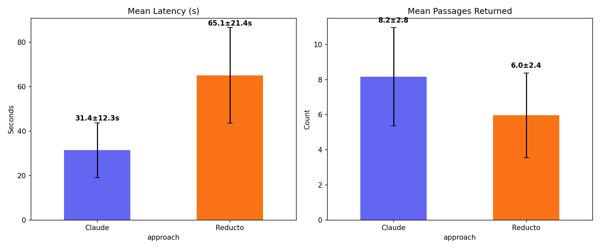
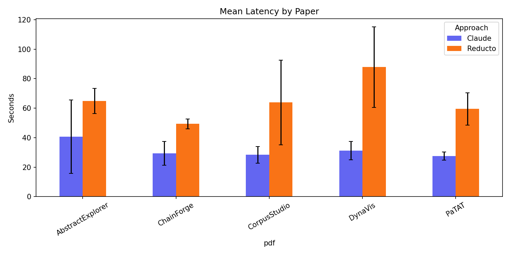

# Highlights

Support and sketch code for dynamic highlighting project.

## Overview
A simple project that retrieves structured data in response to a query about a pdf. It accepts a pdf url and returns an array of quotes in json matching the query.

To use, run:

`npx tsx index.ts`

__UPDATE:__ To compare Claude to Reducto, run:

`npx tsx compare.ts`

## Comparison of Claude to Reducto

Claude is, in fact, much better at this task than Reducto is. No OCR is needed in either case.

Both Claude and Reducto can take a direct URL to a pdf. Except:
- Claude is 1.7x faster at baseline (here 26.5s vs Reducto's 45s)
- Claude is more accurate (Reducto's answer contains meaningful ommisions, and errors in the section names).
- Both allow for structured output (Claude through the `Zod` schema)
- Claude allows for pdf caching (implemented here as `cache_control`), so if the same file is used in multiple calls it should, in theory, result in shorter query times.

One obvious issue is that both are quite slow, even if Claude is almost twice as fast. 
One possible solution is to accept streaming output and to pinch off objects as they
come through, though that would add substantial complexity to a POC engine. A better
option, as Vihaan suggested, would be a simple UI that updates to show search progress.

Outputs from the example test are below, assuming the example document and query:

```typescript
const PDF_URL = 'https://glassmanlab.seas.harvard.edu/papers/patat_CHI23.pdf';

const USER_QUERY =
  'What are the main contributions of this paper, and what user study or evaluation was conducted to validate them?';
```

### Results Summary

| Metric | Claude | Reducto |
|---|---|---|
| Latency (s) | 26.52 | 45.09 |
| Passages returned | 6 | 5 |
| Section label errors | 0 | 2 |

Claude is 1.7x faster, returns more passages, and produces cleaner section labels. Reducto mislabels Introduction content as "ABSTRACT." Both produce accurate extracted text — no hallucinated or fabricated passages in either case.

## Multi-Paper Benchmark

Ran both approaches across 5 papers from [Glassman Lab](https://glassmanlab.seas.harvard.edu/) x 5 queries each.

**Papers:** PaTAT, ChainForge, DynaVis, AbstractExplorer, CorpusStudio

**Queries:**
1. What are the main contributions, and what user study or evaluation was conducted?
2. What system or tool does this paper present, and how does it work?
3. What are the key findings or results?
4. What limitations or future work do the authors discuss?
5. What related work or prior approaches do the authors compare against?

To reproduce: `npx tsx benchmark.ts`, then `python plot_benchmark.py`.




Claude is consistently faster and returns more passages across all papers and queries. Raw quotes are in `results/benchmark_quotes.json`.

### Example Output

```json
────────────────────────────────────────────────────────────
APPROACH: Reducto
LATENCY:  45.09s
RESULT:
[
  {
    "text": "This paper makes the following contributions: (1) A new interactive program synthesis approach that learns symbolic representation of codes and themes through patterns that capture the lexical, syntactic, and semantic features from the user’s qualitative coding process in real-time. (2) PaTAT, a practical system that implements this approach with a mixed-initiative interface for effective human-AI collaboration in thematic analysis that facilitates not only the performance of the annotation but also the learning of its users. (3) A lab user study with 8 experienced qualitative researchers that demonstrate the usefulness, usability, and effectiveness of PaTAT.",
    "section": "ABSTRACT"
  },
  {
    "text": "We illustrate the usability of PaTAT through a lab user study with eight qualitative researchers. Participants found PaTAT usable and useful for their qualitative analysis workflow. The findings of this study also suggest design implications for future AI-enabled qualitative analysis-assisting tools, e.g., regarding adapting different models and interaction strategies based on task goals and contexts while working with ambiguities and uncertainties.",
    "section": "ABSTRACT"
  },
  {
    "text": "A user study with 8 qualitative researchers illustrated PaTAT's usefulness in providing qualitative coding assistance and effectiveness in facilitating the human learning of data.",
    "section": "CONCLUSION"
  },
  {
    "text": "We conducted a lab user study with 8 participants with qualitative coding experience to evaluate PaTAT. The study examined the following research questions: RQ1: How effective is PaTAT in providing explainable code recommendations for the user's annotation tasks in qualitative coding? RQ2: How useful is PaTAT for facilitating the learning of users, i.e., the discovery of new themes, trends, and connections among data items? RQ3: How well can PATAT address the ambiguous, dynamic, and iterative nature of qualitative coding?",
    "section": "5 USER STUDY"
  },
  {
    "text": "All participants interacted with a version of the system for 30 minutes in each condition. When interacting with the PaTAT condition, participants added 83 annotations with 8.5 codes on average. PaTAT achieves good prediction accuracy in code recommendations after learning from user annotations. The results also suggest that while the different interaction mechanisms used in PaTAT can introduce complexity, they make significant contributions to knowledge discovery, facilitating user learning, and overall user-perceived usefulness in the qualitative coding process.",
    "section": "5.3 Study results"
  }
]

────────────────────────────────────────────────────────────
APPROACH: Claude (native PDF, no OCR)
LATENCY:  26.52s
RESULT:
[
  {
    "text": "This paper makes the following contributions:\n(1) A new interactive program synthesis approach that learns symbolic representation of codes and themes through patterns that capture the lexical, syntactic, and semantic features from the user's qualitative coding process in real-time.\n(2) PaTAT, a practical system that implements this approach with a mixed-initiative interface for effective human-AI collaboration in thematic analysis that facilitates not only the performance of the annotation but also the learning of its users.\n(3) A lab user study with 8 experienced qualitative researchers that demonstrate the usefulness, usability, and effectiveness of PaTAT.",
    "section": "Introduction"
  },
  {
    "text": "We illustrate the usability of PaTAT through a lab user study with eight qualitative researchers. Participants found PaTAT usable and useful for their qualitative analysis workflow. The findings of this study also suggest design implications for future AI-enabled qualitative analysis-assisting tools, e.g., regarding adapting different models and interaction strategies based on task goals and contexts while working with ambiguities and uncertainties.",
    "section": "Introduction"
  },
  {
    "text": "We conducted a lab user study with 8 participants with qualitative coding experience to evaluate PaTAT. The study examined the following research questions:\n• RQ1: How effective is PaTAT in providing explainable code recommendations for the user's annotation tasks in qualitative coding?\n• RQ2: How useful is PaTAT for facilitating the learning of users, i.e., the discovery of new themes, trends, and connections among data items?\n• RQ3: How well can PaTAT address the ambiguous, dynamic, and iterative nature of qualitative coding?",
    "section": "User Study"
  },
  {
    "text": "We used a within-subjects study design where each participant used the system under three different conditions:\n• MANUAL: a baseline version of PaTAT without any intelligent features such as code recommendation, ranking, and grouping.\n• BERT: a version of PaTAT using a 'black-box' BERT model to make code recommendations... no explanations (e.g., within-item text highlights, the display of learned patterns) were available due to the black-box nature of the model.\n• PaTAT: a full version of PaTAT using our pattern-based synthesizer, with all key features including label recommendations, explanations, ranking, and grouping.",
    "section": "Study Design"
  },
  {
    "text": "All participants interacted with a version of the system for 30 minutes in each condition. When interacting with the PaTAT condition, participants added 83 annotations with 8.5 codes on average. PaTAT achieves good prediction accuracy in code recommendations after learning from user annotations. The results also suggest that while the different interaction mechanisms used in PaTAT can introduce complexity, they make significant contributions to knowledge discovery, facilitating user learning, and overall user-perceived usefulness in the qualitative coding process.",
    "section": "Study Results"
  },
  {
    "text": "Participants considered PaTAT more difficult to use and less controllable relative to fully manual annotation, but, compared to the other AI-assisted approach—the 'black box' BERT condition—PaTAT's interpretable pattern-based approach shows a clear advantage in usefulness, user-perceived sense of control, and facilitation of human learning.",
    "section": "Quantitative Results"
  }
]
```

```

## TODO
- [x] (once, cached) send PDF to https://deepinfra.com/allenai/olmOCR-2-7B-1025 and get back full-text
- [x] send textbox contents and full-text to Claude (or GPT....), ask for JSON of quotes in response
- [ ] situate conceptually in bigger repo
- [ ] front end POC
- [ ] finesse schema

## Learnings
- Reducto can do just about everything, and this dramatically simplifies the pipeline.
- If it can't satisfy your request, Reducto might search the text in its own system prompt to make you happy and return an answer. Beware!
- (If using Claude) use Zod for structured calls and returns. Can enforce a schema (json) and seems to work well with Claude.
- You have to convert a Pdf to image before sending to deep-infra. Using `pdf-to-img`.
- Deep Infra benefits from explicit instructions to _not_ summarize the text, instead to return text verbatim.